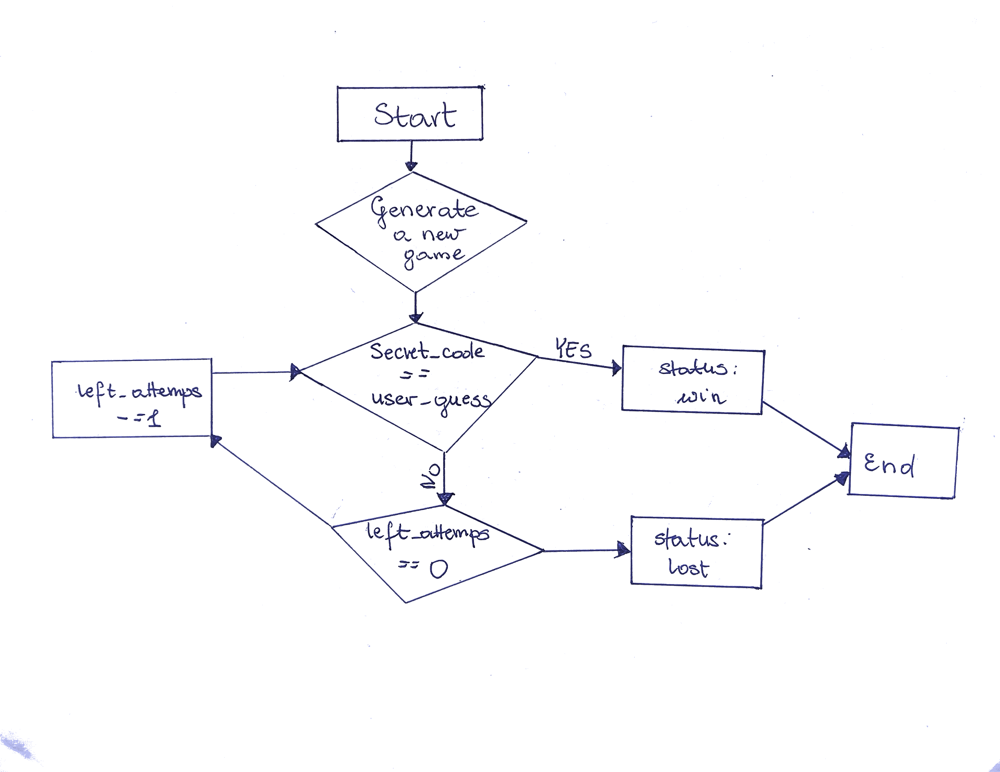

# Mastermind Game

# Сontents
- [Mastermind Game](#mastermind-game)
- [Сontents](#сontents)
- [About the game](#about-the-game)
- [Available scripts](#available-scripts)
- [Build and Run Instructions](#build-and-run-instructions)
- [Database setup](#database-setup)
- [Frontend setup](#frontend-setup)
- [Extensions](#extensions)
- [Development Environment and Relevant Technologies](#development-environment-and-relevant-technologies)
- [Design Process](#design-process)
- [API Endpoints](#api-endpoints)
- [Technologies](#technologies)
- [Dependencies](#dependencies)
- [Challenges](#challenges)
- [Future work](#future-work)
- [Conclusion](#conclusion)

# About the game

Mastermind is a strategy game where the player has to guess the 4 number combinations. 
At the start of the game the computer will randomly select a pattern of four different numbers from 0 to 7 for a total of 8 different numbers.
At the end of each guess, the computer will provide one of the following responses as feedback:
- The player had guessed a correct number
- The player had guessed a correct number and its correct location
- The player’s guess was incorrect
 
There are 3 levels of game complexity:
- Easy Level: 4-digit number to guess, 10 attempts, secrete code length 4, no duplicates and hints
- Medium Level: 5-digit number to guess, 9 attempts, secrete code length 5, duplicates allowed and hints
- Hard Level: 6-digit number to guess, 8 attempts, secrete code length 6, duplicates allowed and hints


# Build and Run Instructions

Prerequisites
- Ensure that Python is installed on your system.
- Ensure that you have pip for installing packages, and Docker to use the docker-compose.yaml file to run the project.


<ol>
<li>Clone repository from GitHub: 

```
https://github.com/MagdaSlifierz/mastermindReach.git
```

</li>
<li>Go to the project's root folder:

```
cd mastermindReach
```
</li>

<li >
Set up the Virtual Environment
Create a virtual environment named .venv

```
python -m venv .venv
```
Activate the Virtual Environment
```
- On macOS and Linux:
source .venv/bin/activate

- On Windows:
.\.venv\Scripts\activate
```
</li>

<li>
Install Dependencies listed in the requirements.txt file

```
pip install -r requirements.txt
```
</li>

<li>

Rename .env.example file to 

```
.env
```
</li>

# Database setup
<li>

[Setup PostgreSQL database](#build-and-run-instructions)

I recommend to use Docker to create docker image.
Make sure that your Docker Desktop is running and run 
```
docker-compose up -d
```
</li>

<li>
Database and Alembic

Run migrations to set up database schema
```
alembic upgrade head
```
</li>


<li>
Run locally the FastAPI Server

Start the FastAPI application. Run a file main.py

```
uvicorn main:app --reload
```

# Frontend setup
<l1>

Before you begin, ensure you have met the following requirements
- Node.js (12 or newer)
- npm (Node Package Manager)

</l1>

<l1>

Install the dependencies

```
npm install
```
</l1>

<l1>
Running the Application
To run frontend application, use these comment

```
npm run dev
```

This will start the server at http://localhost:3000. Open your browser and navigate to this URL to view the application.

</l1>

</ol>


# Extensions

- [x] Add support to give hints
- [x] Add a configurable “difficulty level” and adjust the number of numbers that are used
- [x] Change feedback into voice mode
- [x] Multiplayer support *
- [x] Keep track of scores *

* Core functionality are implemented on the backend data access layer. I miss the frontend implementation and REST API endpoints

# Development Environment and Relevant Technologies

Visual Studio Code, PyCharm, WebStorm, DataGrip, Docker, iTerm, and Postman

Backend: Python, FastAPI, Alembic, PostgreSQL

Frontend: Typescript, Remix, TailwindCSS, and Zod

# Design Process
<ol>

<li>I began developing this application by designing the logic game, which helped me grasp the core logic and identify the necessary entities. This initial phase lasted three days before I started the implementation.</li><br>



```
When a user hits the start game, then two requests are send to create a game and create the first attempt.

```

```

`Attempts` is updated after each submission with the user's guesses.
```

```
`Feedback` is populated with empty strings and updated after each attempt.

```
```
  '2 correct number(s), 0 correct place(s)',
  '1 correct number(s), 1 correct place(s)',
  '1 correct number(s), 1 correct place(s)',
  '0 correct number(s), 0 correct place(s)',
  '',
  '',
  '',
  ''
```
```

`Hint` is initially populated with \"----" \ values and updated each time the user asks for a hint.

  "2 - 0 -",
```
```
`The text-to-voice convertion` the user is able to click on the button and hear the given feedback.
 This feature is designed to enhance accessibility, particularly for users with visual impairments. By allowing users to click a button to hear the feedback spoken aloud, the application becomes more inclusive, ensuring that all users, regardless of their ability to read text on a screen, can fully engage with and benefit from the software. 

```

```
The game continues until the user guesses the code or the user is out of attempts
```

<li>
Then, I defined database models (Attempt, Difficulty, Game, User) to interact in a relational database system using SQLAlchemy. <br>

 ```
Users
  - id: Integer, primary key, auto-increment
  - username: Text, not null, unique  
```

```
Games
  - id: Integer, primary key, auto-increment
  - difficulty_id: Integer, ForeignKey('difficulties.id'), not null
  - status: String, default 'in_progress'
  - is_multiplayer: String, default 'false'
  - secret_code: String
  - hints: String, default ''
  ```

```
Difficulty
  - id: Integer, primary key, auto-increment
  - name: Text, not null, unique
  - label: Text, not null, unique
  - max_attempts: Integer, not null
  - code_length: Integer, not null
  - minimum_number: Integer, not null
  - maximum_number: Integer, not null
  - is_duplicate_allowed: Boolean
```

```
Attempt
  - id: Integer, primary key, auto-increment
  - game_id: Integer, ForeignKey('games.id'), not null
  - number_of_attempts: Integer, not null
  - guess: Text, not null
  - feedback: Text, not null

```


After that I establish a connection to my database using configuration settings in models.database.
The next step was to utilize a migration tool Alembic to manage database schema changes. This tool helped me version my database schema and apply incremental changes without loss of data.

</li>

*code structure for database models:*

```
mastermind-game-main/
└── models
  ├── init.py # Package initializer, possibly importing all models for easy access
  ├── attempt.py # Defines the Attempt model for tracking game attempts
  ├── database.py # Configures database connections and possibly ORM settings
  ├── difficulty.py # Contains the Difficulty model, defining game difficulty levels
  ├── game.py # Defines the Game model, central to game management
  ├── user.py # Contains the User model, representing users of the application

```

<li>

After having set the database, I created database schemas for before developed tables that would automatically migrate during the first run. I created Pydantic schemas to facilitate data validation and parsing for operations involving my SQLAlchemy models. I ensure that data coming in and out of my API endpoints meets specific criteria, enhancing the robustness and security of my application.

*code structure:*
```
mastermind-game-main/
└── schemas
  ├── init.py # Package initializer, imports all schemas for easy access
  ├── user_schema.py # Schemas related to User operations
  ├── game_schema.py # Schemas related to Game operations
  ├── difficulty_schema.py # Schemas for Difficulty settings
  └── attempt_schema.py # Schemas for handling game attempts
```
</li>

<li>

The next step was to design services logic such as AttemptService, DifficultyService, GameService, and UserService. I wanted to make sure that it = encapsulate the business logic of the game in a clean and modular way. Each service handles specific aspects of the game, making the codebase easier to manage, test, and scale.

*code structure:*
```
mastermind-game-main/
└── services
    ├── attempt_service.py      # Manages game attempts and feedback generation
    ├── difficulty_service.py   # Handles difficulty settings and retrieval
    ├── game_service.py         # Manages game lifecycle and states
    └── user_service.py         # Manages user data and interactions
```


The AttemptService functionality:
- Feedback Generation: Compares user guesses with the secret code, generating detailed feedback. This is core to Mastermind, where feedback is crucial for guiding player guesses.
- Game Progress Tracking: Updates the game's status based on attempts, marking it as won or lost accordingly. This helps in maintaining the state of the game across different sessions.

- The DifficultyService functionality:
- Difficulty Management: Provides methods to retrieve difficulty levels from the database, allowing the game to adjust complexity based on user selection or predefined settings.

- The GameService functionality:
- Game Initialization and State Management: Handles the creation of new games, including generating secret codes if required, and maintains the overall game state.
- Hint Provisioning: Dynamically provides hints to the player, which is a strategic part of the game helping players to solve the puzzle more effectively.

- The UserService functionality:
- User Management: Handles operations related to users, such as creating new user records and retrieving user-specific data, which could include user stats or games played.
</li>


<li>

The specific functions implemented in the AttemptService are essential for managing the gameplay mechanics of Mastermind.

The fundamental for generating accurate feedback about how many characters match in value and position was implemented in ```create_frequency_map``` function: This function facilitates efficient comparison of guesses against the secret code by counting occurrences of each character.
Next crucially assesses how closely a guess aligns with the secret code, providing immediate and precise feedback on the accuracy of the player's guess, was implemented in ```compare_secret_code_to_user_guess``` function.
The ```create_feedback``` function interprets the results of the guess comparison to provide clear and actionable feedback to the player, influencing their tactics and decisions in future attempts. The next implementation focused on
```game_is_over``` that determines whether the game has concluded, either by winning or losing. This part is a key for managing game flow and initiating any subsequent actions like updating scores.

</li>


<li>
After creating the logic I decided to create the routers for the application. Each router file is dedicated to a particular entity, aligning with the principle of separation of concerns. I used FastAPI's Depends for dependency injection to ensure that each endpoint has access to the necessary services through clean and testable patterns.
I also focused on appropriate status codes to signify the result of an operation (201 Created for successful creation, 200 OK for successful retrieval, 404 Not Found for unavailable resources) to provide immediate and standard feedback to the client about the outcome of their request.

*code structure:*
```
 
 mastermind-game-main/
└── routers
    ├── attempt_router.py       # Manages endpoints related to game attempts
    ├── base_router.py          # Manages all routers 
    ├── difficulty_router.py    # Handles endpoints for game difficulty settings
    ├── game_router.py          # Routes related to game management and operations
    └── user_router.py          # Manages user-related endpoints
   
```

# API Endpoints

After structure my code structure I created endpoints, and made a description for each of them as well as the HTTP methods they use, and their response models along with typical status codes.
My setup helped me to keeps the router layer lightweight and focused solely on request handling. I also promoted clean architecture by separating concerns between routing, business logic (services), and data modeling (models).

| HTTP Method | Endpoint                        | Description                                      | Response Model              | Status Code              |
|-------------|---------------------------------|--------------------------------------------------|-----------------------------|--------------------------|
| **GET**     | `/difficulties`                 | Retrieves all difficulty settings.               | `List[DifficultySchema]`    | `200 OK`                 |
| **GET**     | `/difficulties/{difficulty_id}` | Retrieves a specific difficulty by ID.           | `DifficultySchema`          | `200 OK` / `404 Not Found`|
| **POST**    | `/games`                        | Initiates a new game, setting up necessary data. | `GameSchema`                | `201 Created`            |
| **GET**     | `/games`                        | Lists all games in the system.                   | `List[GameSchema]`          | `200 OK`                 |
| **GET**     | `/games/{game_id}`              | Retrieves detailed information about a game.     | `GameSchema`                | `200 OK` / `404 Not Found`|
| **POST**    | `/games/{game_id}/attempts`     | Creates a new attempt for a specified game.      | `AttemptSchema`             | `201 Created`            |
| **GET**     | `/games/{game_id}/attempts`     | Lists all attempts for a specified game.         | `List[AttemptSchema]`       | `200 OK`                 |
| **GET**     | `/games/{game_id}/hints`        | Provides a hint for the specified game.          | `str`                       | `200 OK` / `404 Not Found`|
| **POST**    | `/users`                        | Creates a new user profile.                      | `Location Header`           | `201 Created`            |
| **GET**     | `/users/{user_id}`              | Retrieves information about a specific user.     | `UserSchema`                | `200 OK` / `404 Not Found`|

I used methods as POST and GET
- **POST Methods**:
  - Used for creating new resources. A `201 Created` status code is returned upon successful creation along with the resource data.
- **GET Methods**:
  - Used for retrieving information. A `200 OK` status code is returned when the data is successfully retrieved. If a specified resource is not found, a `404 Not Found` status code is returned.

</li>
<li>
The next step was to create the fronted for my backend application. I choose Remix for developing the frontend client for my FastAPI-powered application.

The picture shows the main page to start the game 


This is the page representing the game itself


User is able to click on the hints button and the hint is dispay on page


The picture shows the winning information when the user actually guess the correct number


This picture represent the difficulty level. In this case user has to guess 5 number combination


When the user lost the button is disabled and the information is shown You lost!


</li>


<li>

Finally, I added some tests for the game logic. Due to time constraints, my strategic approach was taken to testing: using Postman for comprehensive endpoint testing and focusing on writing unit tests for the core game logic with Pytest.
If I had more time, I would definitely write integration tests covering all aspects of the application, from HTTP request handling to database responses.

</li>


</ol>

# Technologies
- Python
- FastAPI
- SQLAlchemy
- PostgreSQL
- Pytest

# Dependencies
```
mastermind-game-main
├── alembic==1.7.5
├── fastapi==0.75.0
├── psycopg2-binary==2.9.3 
├── pydantic==1.9.0
├── python-dotenv==0.19.2
├── sqlalchemy==1.4.27
├── uvicorn==0.16.0
├── pytest==7.0.1
```

# Challenges

- When setting up a database, I encountered a problem: the port was already in use. 
  I managed to start the database by killing the existing process
```
sudo lsof -i :8000
sudo kill -9 [PID number]
```
- Due to the lack of time I was not able to implement the multi-player functionality in the client side.

# Future work

- [ ] Keep track of scores
- [ ] Add a timer
- [ ] Add a timer for each attempt

# Conclusion
Thank you for taking the time to explore this README and learn the details of this project. I am deeply grateful for the opportunity to work on such an engaging challenge and for the invitation to this phase of the interview process. This project has not only been a significant learning experience but also a chance to demonstrate my commitment to both code quality and functionality.

Throughout this week, I strived to push boundaries of what I could design and implement within a constrained timeframe, focusing intently on creating a project that is both robust and maintainable. My aim was to ensure that every line of code not only serves its purpose efficiently but is also clear and accessible for other developers. I am excited about the possibility of receiving your feedback, which I view as crucial to my continuous improvement as a developer. I look forward to discussing this project further and exploring my thought process and the goals of the project.

Thank you once again!